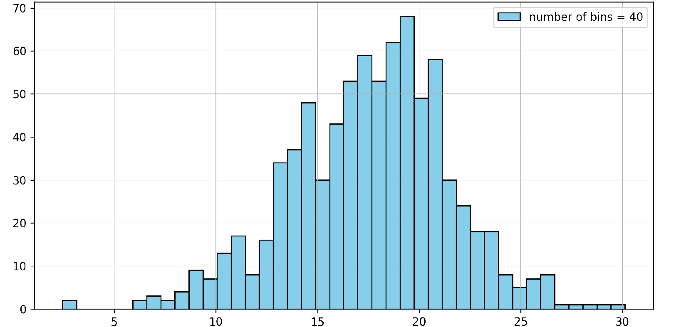

# Documentation

## Sommaire

1. [Introduction](#introduction)
2. [Commandes](#commandes)
3. [Configuration](#configuration)
4. [Exemples](#exemples)

## Introduction

### Description

- Générer des datasets d'images synthétiques.
- Structure de script ergonomique pour définir de nouveaux générateurs d'images.
- Produire des informations statistiques liées au SNR pour chaque dataset.

### Structure


### Scripts python utils

- `generate_data` contient les scripts essentiels pour la génération de dataset.
- `data_analysis` contient les scripts pour générer des informations statistiques sur les datasets.
- `main.py` permet de générer un dataset d'images synthétiques grâce au fichier `./config/config.yaml`.

Voir [Configuration](#configuration) pour plus d'information sur la génération de datasets.

### Exemples

## Commandes

Pour générer un dataset, lancer la commande suivante dans le terminal :

```
python3 main.py # lancer le script

python3 main.py --saved # sauvegarder
```

## Configuration

### Structure


- Le fichier `config.yaml` est lue par le script `main.py`.
- Les configurations peuvent être sauvegardées dans le dossier `saved/`.
- Les fichiers `img_generators.yaml` et `noise_generators.yaml` listent les exemples de configuration pour les paramètres des générateurs.

### Exemples

#### Le fichier `config.yaml`

Un exemple de configuration :

```yaml
location: "/home/victor-scht/Documents/Innov+/Data/" # where you store your data
directory_name: patch_uniform # a subfolder
shading: # if you want to shade generated images
  status: True
  parameters: # where to put the sun
    elevation: 1
    x_range:
      min: -0.2
      max: 1.2
    y_range:
      min: -0.2
      max: 1.2
generator_image_parameters:
  channels: 1
  side: 400
  num_shapes: 3
generator_images: generate_random_shapes
generator_noise: gen_noise_uniform
generator_noise_parameters:
  max_val: 0.005
  min_val: 0.0001
n_samples: 1000
train_split: 0.8
```

### Autres

- Les autres fichiers listent les paramètres des générateurs possibles.
- Pour changer de générateur copier les paramètres d'un générateur et remplacer les dans le fichier `config.yaml`

#### Exemple : `img_generators.yaml`

```yaml
generators_imgs:
  - random_shapes:
    generator_image_parameters:
      channels: 1
      num_shapes: 3
      side: 400
    generator_images: generate_random_shapes

  - uniform_patches:
    generator_images: gen_patch_uniform
    generator_image_parameters:
      side: 40
      channels: 1

  - gen_frequence:
    generator_image_parameters:
      side: 100
      frequence: 2
    generator_images: gen_freq
```

## Définir un nouveau générateur

- Il est possible de définir un nouveau générateur de façon relativement simple en modifiant le fichier `./generate_data/generators.py`.
- Il suffit d'y ajouter la syntaxe suivante :

```python

# decorator pour un générateur de bruit
@decorator_noise
def noise_generator(img,parameters):
    return

# decorator pour un générateur d'image
@decorator_im
def image_generator(parameters):
    return


```

- Puis de modifier la configuration dans le fichier `./config/config.yaml` de manière adéquate :

## Exemples

### random_shapes

#### images bruitées


#### distribution de SNR


